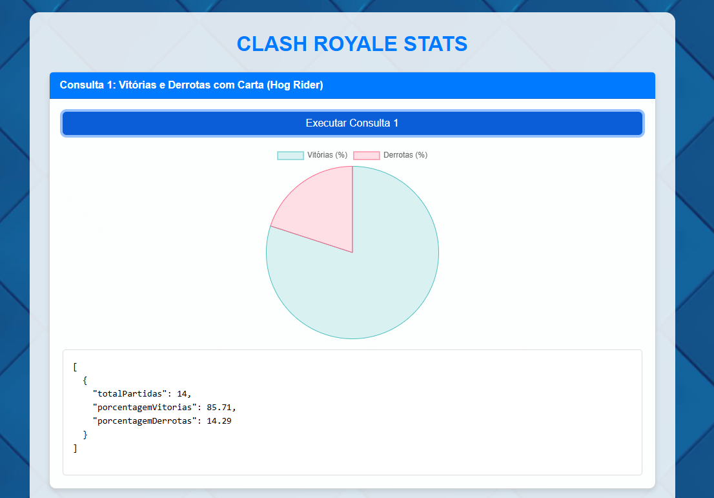

# 📦 Clash Royale Stats

A website to display analytics made with Clash Royale API data.

## 📸 Demo



---

## 🛠️ Installation Guide

### Prerequisites

- [Node.js](https://nodejs.org/) v18+

### Installation - Backend

Clone the repository:

```bash
git clone https://github.com/viniciusgss/Banco-clash-royale.git
cd Banco-clash-royale
```

Install dependencies:

```bash
npm install
# or
yarn install
```

Set up environment variables:

```bash
cp .env.example .env
# edit the .env file as needed
# MONGODB_URI
# PORT
```

Run the project:

```bash
npm run start
# or
yarn start
```

### Installation - Frontend

Clone the repository:

```bash
git clone https://github.com/viniciusgss/Banco-clash-royale.git
cd Banco-clash-royale
```

Open with Live Server

---

## 📘 API Reference

### Base URL

```
https://banco-clash-royale.onrender.com
```

### Endpoints

#### `GET /api/consultas/1`

Retorna a quantidade total de partidas, a porcentagem de vitórias e derrotas nas batalhas do mês de abril de 2025 que utilizaram a carta "Hog Rider" no deck do jogador.

**Response:**

```json
[
  {
    "totalPartidas": 14,
    "porcentagemVitorias": 57.14,
    "porcentagemDerrotas": 14.29
  }
]
```

#### `GET /api/consultas/2`

Retorna os decks com porcentagem de vitórias superior a 40% em partidas de abril de 2025, ordenados pela taxa de vitória.

**Response:**

```json
[
  {
    "totalPartidas": 4,
    "vitorias": 4,
    "porcentagemVitorias": 100,
    "deck": [
      "Hog Rider",
      "Valkyrie",
      "Goblins",
      "Spear Goblins",
      "Fireball",
      "Zap",
      "Cannon",
      "Ice Wizard"
    ]
  },
  {
    "totalPartidas": 4,
    "vitorias": 3,
    "porcentagemVitorias": 75,
    "deck": [
      "Golem",
      "Baby Dragon",
      "Night Witch",
      "Mega Minion",
      "Lightning",
      "Tornado",
      "Elixir Collector",
      "Lumberjack"
    ]
  },
  {
    "totalPartidas": 12,
    "vitorias": 6,
    "porcentagemVitorias": 50,
    "deck": [
      "Lava Hound",
      "Balloon",
      "Minions",
      "Skeleton Dragons",
      "Fireball",
      "Arrows",
      "Tombstone",
      "Mega Minion"
    ]
  },
  {
    "totalPartidas": 4,
    "vitorias": 2,
    "porcentagemVitorias": 50,
    "deck": [
      "Royal Giant",
      "Barbarians",
      "Minion Horde",
      "Royal Recruits",
      "Rocket",
      "Rage",
      "Goblin Hut",
      "Princess"
    ]
  },
  {
    "totalPartidas": 4,
    "vitorias": 2,
    "porcentagemVitorias": 50,
    "deck": [
      "Giant",
      "Witch",
      "Skeleton Army",
      "Mini P.E.K.K.A",
      "Poison",
      "Tornado",
      "Tesla",
      "Sparky"
    ]
  },
  {
    "totalPartidas": 4,
    "vitorias": 2,
    "porcentagemVitorias": 50,
    "deck": [
      "P.E.K.K.A",
      "Dark Prince",
      "Electro Wizard",
      "Bats",
      "Poison",
      "Zap",
      "Inferno Tower",
      "The Log"
    ]
  }
]
```

#### `GET /api/consultas/3`

Conta o número total de derrotas em que o deck do jogador continha as cartas "Fireball" e "Zap" combinadas, nas partidas de abril de 2025.

**Response:**

```json
[
  {
    "totalDerrotas": 2,
    "combo": [
      "Fireball",
      "Zap"
    ]
  }
]
```

#### `GET /api/consultas/4`

Calcula o total de vitórias onde o deck do jogador continha a carta "Fireball" (em qualquer mês).

**Response:**

```json
[
  {
    "totalDerrotas": 2,
    "combo": [
      "Fireball",
      "Zap"
    ]
  }
]
```

#### `GET /api/consultas/5`

Identifica combinações de 2 cartas (pares) que aparecem em decks com mais de 50% de taxa de vitórias, em partidas de abril de 2025.

**Response:**

```json
[
  {
    "totalPartidas": 4,
    "vitorias": 4,
    "porcentagemVitorias": 100,
    "combo": [
      "Cannon",
      "Valkyrie"
    ]
  },
  {
    "totalPartidas": 4,
    "vitorias": 4,
    "porcentagemVitorias": 100,
    "combo": [
      "Goblins",
      "Spear Goblins"
    ]
  },
  {
    "totalPartidas": 4,
    "vitorias": 4,
    "porcentagemVitorias": 100,
    "combo": [
      "Fireball",
      "Goblins"
    ]
  },
  {
    "totalPartidas": 4,
    "vitorias": 4,
    "porcentagemVitorias": 100,
    "combo": [
      "Ice Wizard",
      "Valkyrie"
    ]
  },
  {
    "totalPartidas": 4,
    "vitorias": 4,
    "porcentagemVitorias": 100,
    "combo": [
      "Hog Rider",
      "Ice Wizard"
    ]
  },
  {
    "totalPartidas": 4,
    "vitorias": 4,
    "porcentagemVitorias": 100,
    "combo": [
      "Ice Wizard",
      "Spear Goblins"
    ]
  },
  {
    "totalPartidas": 4,
    "vitorias": 4,
    "porcentagemVitorias": 100,
    "combo": [
      "Goblins",
      "Ice Wizard"
    ]
  },
  {
    "totalPartidas": 4,
    "vitorias": 4,
    "porcentagemVitorias": 100,
    "combo": [
      "Spear Goblins",
      "Valkyrie"
    ]
  },
  {
    "totalPartidas": 4,
    "vitorias": 4,
    "porcentagemVitorias": 100,
    "combo": [
      "Fireball",
      "Spear Goblins"
    ]
  },
  {
    "totalPartidas": 4,
    "vitorias": 4,
    "porcentagemVitorias": 100,
    "combo": [
      "Ice Wizard",
      "Zap"
    ]
  },
  {
    "totalPartidas": 4,
    "vitorias": 4,
    "porcentagemVitorias": 100,
    "combo": [
      "Valkyrie",
      "Zap"
    ]
  },
  {
    "totalPartidas": 4,
    "vitorias": 4,
    "porcentagemVitorias": 100,
    "combo": [
      "Goblins",
      "Hog Rider"
    ]
  },
  {
    "totalPartidas": 4,
    "vitorias": 4,
    "porcentagemVitorias": 100,
    "combo": [
      "Cannon",
      "Goblins"
    ]
  },
  {
    "totalPartidas": 4,
    "vitorias": 4,
    "porcentagemVitorias": 100,
    "combo": [
      "Cannon",
      "Ice Wizard"
    ]
  },
  {
    "totalPartidas": 4,
    "vitorias": 4,
    "porcentagemVitorias": 100,
    "combo": [
      "Fireball",
      "Ice Wizard"
    ]
  },
  {
    "totalPartidas": 4,
    "vitorias": 4,
    "porcentagemVitorias": 100,
    "combo": [
      "Goblins",
      "Zap"
    ]
  },
  {
    "totalPartidas": 4,
    "vitorias": 4,
    "porcentagemVitorias": 100,
    "combo": [
      "Spear Goblins",
      "Zap"
    ]
  },
  {
    "totalPartidas": 4,
    "vitorias": 4,
    "porcentagemVitorias": 100,
    "combo": [
      "Hog Rider",
      "Valkyrie"
    ]
  },
  {
    "totalPartidas": 4,
    "vitorias": 4,
    "porcentagemVitorias": 100,
    "combo": [
      "Hog Rider",
      "Spear Goblins"
    ]
  },
  {
    "totalPartidas": 4,
    "vitorias": 4,
    "porcentagemVitorias": 100,
    "combo": [
      "Goblins",
      "Valkyrie"
    ]
  },
  {
    "totalPartidas": 4,
    "vitorias": 4,
    "porcentagemVitorias": 100,
    "combo": [
      "Cannon",
      "Spear Goblins"
    ]
  },
  {
    "totalPartidas": 4,
    "vitorias": 4,
    "porcentagemVitorias": 100,
    "combo": [
      "Fireball",
      "Valkyrie"
    ]
  },
  {
    "totalPartidas": 4,
    "vitorias": 3,
    "porcentagemVitorias": 75,
    "combo": [
      "Night Witch",
      "Tornado"
    ]
  },
  {
    "totalPartidas": 4,
    "vitorias": 3,
    "porcentagemVitorias": 75,
    "combo": [
      "Golem",
      "Tornado"
    ]
  },
  {
    "totalPartidas": 4,
    "vitorias": 3,
    "porcentagemVitorias": 75,
    "combo": [
      "Baby Dragon",
      "Tornado"
    ]
  },
  {
    "totalPartidas": 4,
    "vitorias": 3,
    "porcentagemVitorias": 75,
    "combo": [
      "Lightning",
      "Tornado"
    ]
  },
  {
    "totalPartidas": 4,
    "vitorias": 3,
    "porcentagemVitorias": 75,
    "combo": [
      "Mega Minion",
      "Tornado"
    ]
  },
  {
    "totalPartidas": 4,
    "vitorias": 3,
    "porcentagemVitorias": 75,
    "combo": [
      "Elixir Collector",
      "Tornado"
    ]
  },
  {
    "totalPartidas": 4,
    "vitorias": 3,
    "porcentagemVitorias": 75,
    "combo": [
      "Lumberjack",
      "Tornado"
    ]
  },
  {
    "totalPartidas": 14,
    "vitorias": 8,
    "porcentagemVitorias": 57.14,
    "combo": [
      "Fireball",
      "Hog Rider"
    ]
  },
  {
    "totalPartidas": 14,
    "vitorias": 8,
    "porcentagemVitorias": 57.14,
    "combo": [
      "Cannon",
      "Zap"
    ]
  },
  {
    "totalPartidas": 14,
    "vitorias": 8,
    "porcentagemVitorias": 57.14,
    "combo": [
      "Hog Rider",
      "Zap"
    ]
  },
  {
    "totalPartidas": 14,
    "vitorias": 8,
    "porcentagemVitorias": 57.14,
    "combo": [
      "Fireball",
      "Zap"
    ]
  },
  {
    "totalPartidas": 14,
    "vitorias": 8,
    "porcentagemVitorias": 57.14,
    "combo": [
      "Cannon",
      "Fireball"
    ]
  },
  {
    "totalPartidas": 14,
    "vitorias": 8,
    "porcentagemVitorias": 57.14,
    "combo": [
      "Cannon",
      "Hog Rider"
    ]
  }
]
```

#### `GET /api/consultas/6`

Calcula a duração média das partidas (em minutos) de abril de 2025. Considera a diferença entre battleTimeEnd e battleTimeBegin para calcular a média.

**Response:**

```json
[
  {
    "decks": [
      {
        "deck": "Archers",
        "partidas": 1
      }
    ],
    "carta": "Archers"
  },
  {
    "decks": [
      {
        "deck": "Arrows",
        "partidas": 1
      }
    ],
    "carta": "Arrows"
  },
  {
    "decks": [
      {
        "deck": "Baby Dragon",
        "partidas": 1
      }
    ],
    "carta": "Baby Dragon"
  },
  {
    "decks": [
      {
        "deck": "Balloon",
        "partidas": 1
      }
    ],
    "carta": "Balloon"
  },
  {
    "decks": [
      {
        "deck": "Barbarians",
        "partidas": 1
      }
    ],
    "carta": "Barbarians"
  },
  {
    "decks": [
      {
        "deck": "Bats",
        "partidas": 1
      }
    ],
    "carta": "Bats"
  },
  {
    "decks": [
      {
        "deck": "Cannon",
        "partidas": 1
      }
    ],
    "carta": "Cannon"
  },
  {
    "decks": [
      {
        "deck": "Dark Prince",
        "partidas": 1
      }
    ],
    "carta": "Dark Prince"
  },
  {
    "decks": [
      {
        "deck": "Electro Wizard",
        "partidas": 1
      }
    ],
    "carta": "Electro Wizard"
  },
  {
    "decks": [
      {
        "deck": "Elixir Collector",
        "partidas": 1
      }
    ],
    "carta": "Elixir Collector"
  },
  {
    "decks": [
      {
        "deck": "Fireball",
        "partidas": 1
      }
    ],
    "carta": "Fireball"
  },
  {
    "decks": [
      {
        "deck": "Giant",
        "partidas": 1
      }
    ],
    "carta": "Giant"
  },
  {
    "decks": [
      {
        "deck": "Goblin Barrel",
        "partidas": 1
      }
    ],
    "carta": "Goblin Barrel"
  },
  {
    "decks": [
      {
        "deck": "Goblin Hut",
        "partidas": 1
      }
    ],
    "carta": "Goblin Hut"
  },
  {
    "decks": [
      {
        "deck": "Goblins",
        "partidas": 1
      }
    ],
    "carta": "Goblins"
  },
  {
    "decks": [
      {
        "deck": "Golem",
        "partidas": 1
      }
    ],
    "carta": "Golem"
  },
  {
    "decks": [
      {
        "deck": "Hog Rider",
        "partidas": 1
      }
    ],
    "carta": "Hog Rider"
  },
  {
    "decks": [
      {
        "deck": "Ice Wizard",
        "partidas": 1
      }
    ],
    "carta": "Ice Wizard"
  },
  {
    "decks": [
      {
        "deck": "Inferno Tower",
        "partidas": 1
      }
    ],
    "carta": "Inferno Tower"
  },
  {
    "decks": [
      {
        "deck": "Knight",
        "partidas": 1
      }
    ],
    "carta": "Knight"
  },
  {
    "decks": [
      {
        "deck": "Lava Hound",
        "partidas": 1
      }
    ],
    "carta": "Lava Hound"
  },
  {
    "decks": [
      {
        "deck": "Lightning",
        "partidas": 1
      }
    ],
    "carta": "Lightning"
  },
  {
    "decks": [
      {
        "deck": "Lumberjack",
        "partidas": 1
      }
    ],
    "carta": "Lumberjack"
  },
  {
    "decks": [
      {
        "deck": "Mega Minion",
        "partidas": 1
      }
    ],
    "carta": "Mega Minion"
  },
  {
    "decks": [
      {
        "deck": "Mini P.E.K.K.A",
        "partidas": 1
      }
    ],
    "carta": "Mini P.E.K.K.A"
  },
  {
    "decks": [
      {
        "deck": "Minion Horde",
        "partidas": 1
      }
    ],
    "carta": "Minion Horde"
  },
  {
    "decks": [
      {
        "deck": "Minions",
        "partidas": 1
      }
    ],
    "carta": "Minions"
  },
  {
    "decks": [
      {
        "deck": "Night Witch",
        "partidas": 1
      }
    ],
    "carta": "Night Witch"
  },
  {
    "decks": [
      {
        "deck": "P.E.K.K.A",
        "partidas": 1
      }
    ],
    "carta": "P.E.K.K.A"
  },
  {
    "decks": [
      {
        "deck": "Poison",
        "partidas": 1
      }
    ],
    "carta": "Poison"
  },
  {
    "decks": [
      {
        "deck": "Princess",
        "partidas": 1
      }
    ],
    "carta": "Princess"
  },
  {
    "decks": [
      {
        "deck": "Rage",
        "partidas": 1
      }
    ],
    "carta": "Rage"
  },
  {
    "decks": [
      {
        "deck": "Rocket",
        "partidas": 1
      }
    ],
    "carta": "Rocket"
  },
  {
    "decks": [
      {
        "deck": "Royal Giant",
        "partidas": 1
      }
    ],
    "carta": "Royal Giant"
  },
  {
    "decks": [
      {
        "deck": "Royal Recruits",
        "partidas": 1
      }
    ],
    "carta": "Royal Recruits"
  },
  {
    "decks": [
      {
        "deck": "Skeleton Army",
        "partidas": 1
      }
    ],
    "carta": "Skeleton Army"
  },
  {
    "decks": [
      {
        "deck": "Skeleton Dragons",
        "partidas": 1
      }
    ],
    "carta": "Skeleton Dragons"
  },
  {
    "decks": [
      {
        "deck": "Sparky",
        "partidas": 1
      }
    ],
    "carta": "Sparky"
  },
  {
    "decks": [
      {
        "deck": "Spear Goblins",
        "partidas": 1
      }
    ],
    "carta": "Spear Goblins"
  },
  {
    "decks": [
      {
        "deck": "Tesla",
        "partidas": 1
      }
    ],
    "carta": "Tesla"
  },
  {
    "decks": [
      {
        "deck": "The Log",
        "partidas": 1
      }
    ],
    "carta": "The Log"
  },
  {
    "decks": [
      {
        "deck": "Tombstone",
        "partidas": 1
      }
    ],
    "carta": "Tombstone"
  },
  {
    "decks": [
      {
        "deck": "Tornado",
        "partidas": 1
      }
    ],
    "carta": "Tornado"
  },
  {
    "decks": [
      {
        "deck": "Valkyrie",
        "partidas": 1
      }
    ],
    "carta": "Valkyrie"
  },
  {
    "decks": [
      {
        "deck": "Witch",
        "partidas": 1
      }
    ],
    "carta": "Witch"
  },
  {
    "decks": [
      {
        "deck": "Zap",
        "partidas": 1
      }
    ],
    "carta": "Zap"
  }
]
```

#### `GET /api/consultas/7`

Retorna o nome dos jogadores que venceram mais partidas usando a carta "P.E.K.K.A" no deck.
Agrupa por nome do jogador e contabiliza as vitórias. Ordena do maior para o menor número de vitórias.

**Response:**

```json
[
  {
    "totalBatalhas": 50,
    "averageDuration": 233.2
  }
]
```

#### `GET /api/consultas/8`

Retorna o nome dos jogadores que venceram mais partidas usando a carta "P.E.K.K.A" no deck.
Agrupa por nome do jogador e contabiliza as vitórias. Ordena do maior para o menor número de vitórias.

**Response:**

```json
[
  {
    "topPlayers": [
      {
        "player": {
          "$ref": "Player",
          "$id": "662e00000000000000000001"
        },
        "vitorias": 2
      },
      {
        "player": {
          "$ref": "Player",
          "$id": "662e00000000000000000019"
        },
        "vitorias": 1
      },
      {
        "player": {
          "$ref": "Player",
          "$id": "662e00000000000000000031"
        },
        "vitorias": 1
      }
    ],
    "carta": "Archers"
  },
  {
    "topPlayers": [
      {
        "player": {
          "$ref": "Player",
          "$id": "662e00000000000000000029"
        },
        "vitorias": 1
      },
      {
        "player": {
          "$ref": "Player",
          "$id": "662e00000000000000000023"
        },
        "vitorias": 1
      },
      {
        "player": {
          "$ref": "Player",
          "$id": "662e00000000000000000011"
        },
        "vitorias": 1
      },
      {
        "player": {
          "$ref": "Player",
          "$id": "662e00000000000000000017"
        },
        "vitorias": 1
      },
      {
        "player": {
          "$ref": "Player",
          "$id": "662e0000000000000000000b"
        },
        "vitorias": 1
      }
    ],
    "carta": "Arrows"
  },
  {
    "topPlayers": [
      {
        "player": {
          "$ref": "Player",
          "$id": "662e00000000000000000021"
        },
        "vitorias": 1
      },
      {
        "player": {
          "$ref": "Player",
          "$id": "662e0000000000000000000f"
        },
        "vitorias": 1
      },
      {
        "player": {
          "$ref": "Player",
          "$id": "662e00000000000000000027"
        },
        "vitorias": 1
      },
      {
        "player": {
          "$ref": "Player",
          "$id": "662e00000000000000000009"
        },
        "vitorias": 1
      },
      {
        "player": {
          "$ref": "Player",
          "$id": "662e0000000000000000001b"
        },
        "vitorias": 1
      }
    ],
    "carta": "Baby Dragon"
  },
  {
    "topPlayers": [
      {
        "player": {
          "$ref": "Player",
          "$id": "662e00000000000000000029"
        },
        "vitorias": 1
      },
      {
        "player": {
          "$ref": "Player",
          "$id": "662e00000000000000000017"
        },
        "vitorias": 1
      },
      {
        "player": {
          "$ref": "Player",
          "$id": "662e00000000000000000011"
        },
        "vitorias": 1
      },
      {
        "player": {
          "$ref": "Player",
          "$id": "662e00000000000000000023"
        },
        "vitorias": 1
      },
      {
        "player": {
          "$ref": "Player",
          "$id": "662e0000000000000000002f"
        },
        "vitorias": 1
      }
    ],
    "carta": "Balloon"
  },
  {
    "topPlayers": [
      {
        "player": {
          "$ref": "Player",
          "$id": "662e00000000000000000018"
        },
        "vitorias": 1
      },
      {
        "player": {
          "$ref": "Player",
          "$id": "662e00000000000000000030"
        },
        "vitorias": 1
      }
    ],
    "carta": "Barbarians"
  },
  {
    "topPlayers": [
      {
        "player": {
          "$ref": "Player",
          "$id": "662e00000000000000000010"
        },
        "vitorias": 1
      },
      {
        "player": {
          "$ref": "Player",
          "$id": "662e00000000000000000028"
        },
        "vitorias": 1
      }
    ],
    "carta": "Bats"
  },
  {
    "topPlayers": [
      {
        "player": {
          "$ref": "Player",
          "$id": "662e00000000000000000001"
        },
        "vitorias": 2
      },
      {
        "player": {
          "$ref": "Player",
          "$id": "662e0000000000000000002b"
        },
        "vitorias": 1
      },
      {
        "player": {
          "$ref": "Player",
          "$id": "662e00000000000000000031"
        },
        "vitorias": 1
      },
      {
        "player": {
          "$ref": "Player",
          "$id": "662e00000000000000000019"
        },
        "vitorias": 1
      },
      {
        "player": {
          "$ref": "Player",
          "$id": "662e00000000000000000007"
        },
        "vitorias": 1
      }
    ],
    "carta": "Cannon"
  },
  {
    "topPlayers": [
      {
        "player": {
          "$ref": "Player",
          "$id": "662e00000000000000000010"
        },
        "vitorias": 1
      },
      {
        "player": {
          "$ref": "Player",
          "$id": "662e00000000000000000028"
        },
        "vitorias": 1
      }
    ],
    "carta": "Dark Prince"
  },
  {
    "topPlayers": [
      {
        "player": {
          "$ref": "Player",
          "$id": "662e00000000000000000028"
        },
        "vitorias": 1
      },
      {
        "player": {
          "$ref": "Player",
          "$id": "662e00000000000000000010"
        },
        "vitorias": 1
      }
    ],
    "carta": "Electro Wizard"
  },
  {
    "topPlayers": [
      {
        "player": {
          "$ref": "Player",
          "$id": "662e0000000000000000001b"
        },
        "vitorias": 1
      },
      {
        "player": {
          "$ref": "Player",
          "$id": "662e00000000000000000021"
        },
        "vitorias": 1
      },
      {
        "player": {
          "$ref": "Player",
          "$id": "662e00000000000000000027"
        },
        "vitorias": 1
      },
      {
        "player": {
          "$ref": "Player",
          "$id": "662e0000000000000000000f"
        },
        "vitorias": 1
      },
      {
        "player": {
          "$ref": "Player",
          "$id": "662e00000000000000000009"
        },
        "vitorias": 1
      }
    ],
    "carta": "Elixir Collector"
  },
  {
    "topPlayers": [
      {
        "player": {
          "$ref": "Player",
          "$id": "662e00000000000000000001"
        },
        "vitorias": 2
      },
      {
        "player": {
          "$ref": "Player",
          "$id": "662e00000000000000000017"
        },
        "vitorias": 1
      },
      {
        "player": {
          "$ref": "Player",
          "$id": "662e00000000000000000029"
        },
        "vitorias": 1
      },
      {
        "player": {
          "$ref": "Player",
          "$id": "662e00000000000000000007"
        },
        "vitorias": 1
      },
      {
        "player": {
          "$ref": "Player",
          "$id": "662e00000000000000000013"
        },
        "vitorias": 1
      }
    ],
    "carta": "Fireball"
  },
  {
    "topPlayers": [
      {
        "player": {
          "$ref": "Player",
          "$id": "662e00000000000000000020"
        },
        "vitorias": 1
      },
      {
        "player": {
          "$ref": "Player",
          "$id": "662e00000000000000000008"
        },
        "vitorias": 1
      }
    ],
    "carta": "Giant"
  },
  {
    "topPlayers": [
      {
        "player": {
          "$ref": "Player",
          "$id": "662e00000000000000000001"
        },
        "vitorias": 2
      },
      {
        "player": {
          "$ref": "Player",
          "$id": "662e00000000000000000031"
        },
        "vitorias": 1
      },
      {
        "player": {
          "$ref": "Player",
          "$id": "662e00000000000000000019"
        },
        "vitorias": 1
      }
    ],
    "carta": "Goblin Barrel"
  },
  {
    "topPlayers": [
      {
        "player": {
          "$ref": "Player",
          "$id": "662e00000000000000000018"
        },
        "vitorias": 1
      },
      {
        "player": {
          "$ref": "Player",
          "$id": "662e00000000000000000030"
        },
        "vitorias": 1
      }
    ],
    "carta": "Goblin Hut"
  },
  {
    "topPlayers": [
      {
        "player": {
          "$ref": "Player",
          "$id": "662e0000000000000000001f"
        },
        "vitorias": 1
      },
      {
        "player": {
          "$ref": "Player",
          "$id": "662e00000000000000000007"
        },
        "vitorias": 1
      },
      {
        "player": {
          "$ref": "Player",
          "$id": "662e00000000000000000013"
        },
        "vitorias": 1
      },
      {
        "player": {
          "$ref": "Player",
          "$id": "662e0000000000000000002b"
        },
        "vitorias": 1
      }
    ],
    "carta": "Goblins"
  },
  {
    "topPlayers": [
      {
        "player": {
          "$ref": "Player",
          "$id": "662e0000000000000000000f"
        },
        "vitorias": 1
      },
      {
        "player": {
          "$ref": "Player",
          "$id": "662e00000000000000000021"
        },
        "vitorias": 1
      },
      {
        "player": {
          "$ref": "Player",
          "$id": "662e0000000000000000001b"
        },
        "vitorias": 1
      },
      {
        "player": {
          "$ref": "Player",
          "$id": "662e00000000000000000009"
        },
        "vitorias": 1
      },
      {
        "player": {
          "$ref": "Player",
          "$id": "662e00000000000000000027"
        },
        "vitorias": 1
      }
    ],
    "carta": "Golem"
  },
  {
    "topPlayers": [
      {
        "player": {
          "$ref": "Player",
          "$id": "662e00000000000000000001"
        },
        "vitorias": 2
      },
      {
        "player": {
          "$ref": "Player",
          "$id": "662e00000000000000000007"
        },
        "vitorias": 1
      },
      {
        "player": {
          "$ref": "Player",
          "$id": "662e00000000000000000013"
        },
        "vitorias": 1
      },
      {
        "player": {
          "$ref": "Player",
          "$id": "662e0000000000000000002b"
        },
        "vitorias": 1
      },
      {
        "player": {
          "$ref": "Player",
          "$id": "662e00000000000000000019"
        },
        "vitorias": 1
      }
    ],
    "carta": "Hog Rider"
  },
  {
    "topPlayers": [
      {
        "player": {
          "$ref": "Player",
          "$id": "662e00000000000000000007"
        },
        "vitorias": 1
      },
      {
        "player": {
          "$ref": "Player",
          "$id": "662e0000000000000000001f"
        },
        "vitorias": 1
      },
      {
        "player": {
          "$ref": "Player",
          "$id": "662e00000000000000000013"
        },
        "vitorias": 1
      },
      {
        "player": {
          "$ref": "Player",
          "$id": "662e0000000000000000002b"
        },
        "vitorias": 1
      }
    ],
    "carta": "Ice Wizard"
  },
  {
    "topPlayers": [
      {
        "player": {
          "$ref": "Player",
          "$id": "662e00000000000000000028"
        },
        "vitorias": 1
      },
      {
        "player": {
          "$ref": "Player",
          "$id": "662e00000000000000000010"
        },
        "vitorias": 1
      }
    ],
    "carta": "Inferno Tower"
  },
  {
    "topPlayers": [
      {
        "player": {
          "$ref": "Player",
          "$id": "662e00000000000000000001"
        },
        "vitorias": 2
      },
      {
        "player": {
          "$ref": "Player",
          "$id": "662e00000000000000000031"
        },
        "vitorias": 1
      },
      {
        "player": {
          "$ref": "Player",
          "$id": "662e00000000000000000019"
        },
        "vitorias": 1
      }
    ],
    "carta": "Knight"
  },
  {
    "topPlayers": [
      {
        "player": {
          "$ref": "Player",
          "$id": "662e00000000000000000023"
        },
        "vitorias": 1
      },
      {
        "player": {
          "$ref": "Player",
          "$id": "662e0000000000000000000b"
        },
        "vitorias": 1
      },
      {
        "player": {
          "$ref": "Player",
          "$id": "662e0000000000000000002f"
        },
        "vitorias": 1
      },
      {
        "player": {
          "$ref": "Player",
          "$id": "662e00000000000000000029"
        },
        "vitorias": 1
      },
      {
        "player": {
          "$ref": "Player",
          "$id": "662e00000000000000000017"
        },
        "vitorias": 1
      }
    ],
    "carta": "Lava Hound"
  },
  {
    "topPlayers": [
      {
        "player": {
          "$ref": "Player",
          "$id": "662e00000000000000000009"
        },
        "vitorias": 1
      },
      {
        "player": {
          "$ref": "Player",
          "$id": "662e00000000000000000021"
        },
        "vitorias": 1
      },
      {
        "player": {
          "$ref": "Player",
          "$id": "662e0000000000000000000f"
        },
        "vitorias": 1
      },
      {
        "player": {
          "$ref": "Player",
          "$id": "662e0000000000000000001b"
        },
        "vitorias": 1
      },
      {
        "player": {
          "$ref": "Player",
          "$id": "662e00000000000000000027"
        },
        "vitorias": 1
      }
    ],
    "carta": "Lightning"
  },
  {
    "topPlayers": [
      {
        "player": {
          "$ref": "Player",
          "$id": "662e0000000000000000000f"
        },
        "vitorias": 1
      },
      {
        "player": {
          "$ref": "Player",
          "$id": "662e0000000000000000001b"
        },
        "vitorias": 1
      },
      {
        "player": {
          "$ref": "Player",
          "$id": "662e00000000000000000027"
        },
        "vitorias": 1
      },
      {
        "player": {
          "$ref": "Player",
          "$id": "662e00000000000000000021"
        },
        "vitorias": 1
      },
      {
        "player": {
          "$ref": "Player",
          "$id": "662e00000000000000000009"
        },
        "vitorias": 1
      }
    ],
    "carta": "Lumberjack"
  },
  {
    "topPlayers": [
      {
        "player": {
          "$ref": "Player",
          "$id": "662e00000000000000000017"
        },
        "vitorias": 1
      },
      {
        "player": {
          "$ref": "Player",
          "$id": "662e0000000000000000001b"
        },
        "vitorias": 1
      },
      {
        "player": {
          "$ref": "Player",
          "$id": "662e00000000000000000009"
        },
        "vitorias": 1
      },
      {
        "player": {
          "$ref": "Player",
          "$id": "662e00000000000000000023"
        },
        "vitorias": 1
      },
      {
        "player": {
          "$ref": "Player",
          "$id": "662e0000000000000000002f"
        },
        "vitorias": 1
      }
    ],
    "carta": "Mega Minion"
  },
  {
    "topPlayers": [
      {
        "player": {
          "$ref": "Player",
          "$id": "662e00000000000000000008"
        },
        "vitorias": 1
      },
      {
        "player": {
          "$ref": "Player",
          "$id": "662e00000000000000000020"
        },
        "vitorias": 1
      }
    ],
    "carta": "Mini P.E.K.K.A"
  },
  {
    "topPlayers": [
      {
        "player": {
          "$ref": "Player",
          "$id": "662e00000000000000000018"
        },
        "vitorias": 1
      },
      {
        "player": {
          "$ref": "Player",
          "$id": "662e00000000000000000030"
        },
        "vitorias": 1
      }
    ],
    "carta": "Minion Horde"
  },
  {
    "topPlayers": [
      {
        "player": {
          "$ref": "Player",
          "$id": "662e00000000000000000001"
        },
        "vitorias": 2
      },
      {
        "player": {
          "$ref": "Player",
          "$id": "662e00000000000000000029"
        },
        "vitorias": 1
      },
      {
        "player": {
          "$ref": "Player",
          "$id": "662e00000000000000000023"
        },
        "vitorias": 1
      },
      {
        "player": {
          "$ref": "Player",
          "$id": "662e00000000000000000019"
        },
        "vitorias": 1
      },
      {
        "player": {
          "$ref": "Player",
          "$id": "662e00000000000000000017"
        },
        "vitorias": 1
      }
    ],
    "carta": "Minions"
  },
  {
    "topPlayers": [
      {
        "player": {
          "$ref": "Player",
          "$id": "662e0000000000000000000f"
        },
        "vitorias": 1
      },
      {
        "player": {
          "$ref": "Player",
          "$id": "662e00000000000000000009"
        },
        "vitorias": 1
      },
      {
        "player": {
          "$ref": "Player",
          "$id": "662e00000000000000000027"
        },
        "vitorias": 1
      },
      {
        "player": {
          "$ref": "Player",
          "$id": "662e0000000000000000001b"
        },
        "vitorias": 1
      },
      {
        "player": {
          "$ref": "Player",
          "$id": "662e00000000000000000021"
        },
        "vitorias": 1
      }
    ],
    "carta": "Night Witch"
  },
  {
    "topPlayers": [
      {
        "player": {
          "$ref": "Player",
          "$id": "662e00000000000000000010"
        },
        "vitorias": 1
      },
      {
        "player": {
          "$ref": "Player",
          "$id": "662e00000000000000000028"
        },
        "vitorias": 1
      }
    ],
    "carta": "P.E.K.K.A"
  },
  {
    "topPlayers": [
      {
        "player": {
          "$ref": "Player",
          "$id": "662e00000000000000000008"
        },
        "vitorias": 1
      },
      {
        "player": {
          "$ref": "Player",
          "$id": "662e00000000000000000028"
        },
        "vitorias": 1
      },
      {
        "player": {
          "$ref": "Player",
          "$id": "662e00000000000000000020"
        },
        "vitorias": 1
      },
      {
        "player": {
          "$ref": "Player",
          "$id": "662e00000000000000000010"
        },
        "vitorias": 1
      }
    ],
    "carta": "Poison"
  },
  {
    "topPlayers": [
      {
        "player": {
          "$ref": "Player",
          "$id": "662e00000000000000000018"
        },
        "vitorias": 1
      },
      {
        "player": {
          "$ref": "Player",
          "$id": "662e00000000000000000030"
        },
        "vitorias": 1
      }
    ],
    "carta": "Princess"
  },
  {
    "topPlayers": [
      {
        "player": {
          "$ref": "Player",
          "$id": "662e00000000000000000018"
        },
        "vitorias": 1
      },
      {
        "player": {
          "$ref": "Player",
          "$id": "662e00000000000000000030"
        },
        "vitorias": 1
      }
    ],
    "carta": "Rage"
  },
  {
    "topPlayers": [
      {
        "player": {
          "$ref": "Player",
          "$id": "662e00000000000000000030"
        },
        "vitorias": 1
      },
      {
        "player": {
          "$ref": "Player",
          "$id": "662e00000000000000000018"
        },
        "vitorias": 1
      }
    ],
    "carta": "Rocket"
  },
  {
    "topPlayers": [
      {
        "player": {
          "$ref": "Player",
          "$id": "662e00000000000000000018"
        },
        "vitorias": 1
      },
      {
        "player": {
          "$ref": "Player",
          "$id": "662e00000000000000000030"
        },
        "vitorias": 1
      }
    ],
    "carta": "Royal Giant"
  },
  {
    "topPlayers": [
      {
        "player": {
          "$ref": "Player",
          "$id": "662e00000000000000000030"
        },
        "vitorias": 1
      },
      {
        "player": {
          "$ref": "Player",
          "$id": "662e00000000000000000018"
        },
        "vitorias": 1
      }
    ],
    "carta": "Royal Recruits"
  },
  {
    "topPlayers": [
      {
        "player": {
          "$ref": "Player",
          "$id": "662e00000000000000000008"
        },
        "vitorias": 1
      },
      {
        "player": {
          "$ref": "Player",
          "$id": "662e00000000000000000020"
        },
        "vitorias": 1
      }
    ],
    "carta": "Skeleton Army"
  },
  {
    "topPlayers": [
      {
        "player": {
          "$ref": "Player",
          "$id": "662e0000000000000000002f"
        },
        "vitorias": 1
      },
      {
        "player": {
          "$ref": "Player",
          "$id": "662e00000000000000000017"
        },
        "vitorias": 1
      },
      {
        "player": {
          "$ref": "Player",
          "$id": "662e00000000000000000029"
        },
        "vitorias": 1
      },
      {
        "player": {
          "$ref": "Player",
          "$id": "662e0000000000000000000b"
        },
        "vitorias": 1
      },
      {
        "player": {
          "$ref": "Player",
          "$id": "662e00000000000000000011"
        },
        "vitorias": 1
      }
    ],
    "carta": "Skeleton Dragons"
  },
  {
    "topPlayers": [
      {
        "player": {
          "$ref": "Player",
          "$id": "662e00000000000000000008"
        },
        "vitorias": 1
      },
      {
        "player": {
          "$ref": "Player",
          "$id": "662e00000000000000000020"
        },
        "vitorias": 1
      }
    ],
    "carta": "Sparky"
  },
  {
    "topPlayers": [
      {
        "player": {
          "$ref": "Player",
          "$id": "662e00000000000000000007"
        },
        "vitorias": 1
      },
      {
        "player": {
          "$ref": "Player",
          "$id": "662e0000000000000000001f"
        },
        "vitorias": 1
      },
      {
        "player": {
          "$ref": "Player",
          "$id": "662e00000000000000000013"
        },
        "vitorias": 1
      },
      {
        "player": {
          "$ref": "Player",
          "$id": "662e0000000000000000002b"
        },
        "vitorias": 1
      }
    ],
    "carta": "Spear Goblins"
  },
  {
    "topPlayers": [
      {
        "player": {
          "$ref": "Player",
          "$id": "662e00000000000000000020"
        },
        "vitorias": 1
      },
      {
        "player": {
          "$ref": "Player",
          "$id": "662e00000000000000000008"
        },
        "vitorias": 1
      }
    ],
    "carta": "Tesla"
  },
  {
    "topPlayers": [
      {
        "player": {
          "$ref": "Player",
          "$id": "662e00000000000000000010"
        },
        "vitorias": 1
      },
      {
        "player": {
          "$ref": "Player",
          "$id": "662e00000000000000000028"
        },
        "vitorias": 1
      }
    ],
    "carta": "The Log"
  },
  {
    "topPlayers": [
      {
        "player": {
          "$ref": "Player",
          "$id": "662e0000000000000000000b"
        },
        "vitorias": 1
      },
      {
        "player": {
          "$ref": "Player",
          "$id": "662e00000000000000000011"
        },
        "vitorias": 1
      },
      {
        "player": {
          "$ref": "Player",
          "$id": "662e0000000000000000002f"
        },
        "vitorias": 1
      },
      {
        "player": {
          "$ref": "Player",
          "$id": "662e00000000000000000023"
        },
        "vitorias": 1
      },
      {
        "player": {
          "$ref": "Player",
          "$id": "662e00000000000000000029"
        },
        "vitorias": 1
      }
    ],
    "carta": "Tombstone"
  },
  {
    "topPlayers": [
      {
        "player": {
          "$ref": "Player",
          "$id": "662e0000000000000000000f"
        },
        "vitorias": 1
      },
      {
        "player": {
          "$ref": "Player",
          "$id": "662e00000000000000000008"
        },
        "vitorias": 1
      },
      {
        "player": {
          "$ref": "Player",
          "$id": "662e0000000000000000001b"
        },
        "vitorias": 1
      },
      {
        "player": {
          "$ref": "Player",
          "$id": "662e00000000000000000027"
        },
        "vitorias": 1
      },
      {
        "player": {
          "$ref": "Player",
          "$id": "662e00000000000000000020"
        },
        "vitorias": 1
      }
    ],
    "carta": "Tornado"
  },
  {
    "topPlayers": [
      {
        "player": {
          "$ref": "Player",
          "$id": "662e0000000000000000002b"
        },
        "vitorias": 1
      },
      {
        "player": {
          "$ref": "Player",
          "$id": "662e00000000000000000013"
        },
        "vitorias": 1
      },
      {
        "player": {
          "$ref": "Player",
          "$id": "662e0000000000000000001f"
        },
        "vitorias": 1
      },
      {
        "player": {
          "$ref": "Player",
          "$id": "662e00000000000000000007"
        },
        "vitorias": 1
      }
    ],
    "carta": "Valkyrie"
  },
  {
    "topPlayers": [
      {
        "player": {
          "$ref": "Player",
          "$id": "662e00000000000000000020"
        },
        "vitorias": 1
      },
      {
        "player": {
          "$ref": "Player",
          "$id": "662e00000000000000000008"
        },
        "vitorias": 1
      }
    ],
    "carta": "Witch"
  },
  {
    "topPlayers": [
      {
        "player": {
          "$ref": "Player",
          "$id": "662e00000000000000000001"
        },
        "vitorias": 2
      },
      {
        "player": {
          "$ref": "Player",
          "$id": "662e0000000000000000001f"
        },
        "vitorias": 1
      },
      {
        "player": {
          "$ref": "Player",
          "$id": "662e0000000000000000002b"
        },
        "vitorias": 1
      },
      {
        "player": {
          "$ref": "Player",
          "$id": "662e00000000000000000013"
        },
        "vitorias": 1
      },
      {
        "player": {
          "$ref": "Player",
          "$id": "662e00000000000000000010"
        },
        "vitorias": 1
      }
    ],
    "carta": "Zap"
  }
]
```

---

## 🤝 Contribution Guide

### How to Contribute

1. Fork the project
2. Create a branch:
   ```bash
   git checkout -b feature/your-feature-name
   ```
3. Commit your changes:
   ```bash
   git commit -m 'feat: your feature description'
   ```
4. Push to your fork:
   ```bash
   git push origin feature/your-feature-name
   ```
5. Open a Pull Request

### Guidelines

- Commits: Use [Conventional Commits](https://www.conventionalcommits.org/)
- Code: Follow linting best practices (ESLint, Prettier, etc.)
- Docs: Update the README and/or API comments if needed

---

## 📄 License

This project is licensed under the [MIT License](LICENSE).

---

## 🙋 Questions?

Open an [issue](https://github.com/viniciusgss/Banco-clash-royale/issues) or contact me via [email](mailto:Viniciusgss22@gmail.com).
